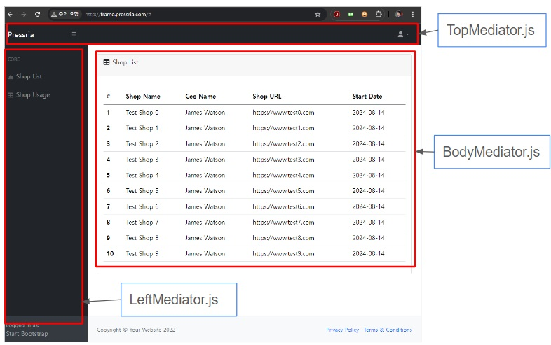

### PressriaFrame
PressriaFrame은 javascript Frame입니다. 
쉽게 이야기 하자면 React와 같은 Frontend Framework입니다. 
Framework이라고 하지 않는 이유는 React와 같이 많은 기능을 내포한 Framework는 아니여서 입니다. 
Javascript 기반의 Frame이니까 그냥 Frame이라고 하겠습니다. 
 
PressriaFrame은 Message기반의 frame입니다. 
하나의 정의된 Class(Mediator)는 다른 Class를 호출할때 Direct로 호출 하지 않습니다. 
정의된 Message를 data와 함께 호출 합니다. 

Sender:

    mediator.notification(mediator.config.GET_SHOP_LIST, {});
    
Receiver:

	respondToGetShopList(mediator, data) {
		let sendData = {
			'receiver': mediator.config.RECEIVE_SHOP_LIST
			, 'namespace' : "shop.Shop.getShopList"
			, "data": {
				'type': 'all'
			}
		}
		mediator.notification(mediator.config.CLIENT_TO_SERVER, sendData);
	}
    
메세지를 보내고 받는 이 부분이 핵심적인 사용 방법 입니다.

사실 이러한 형태는 처음 만들어낸 형태는 아니고 예전에 사용했던 PureMVC의 ActionScript에서 사용하던 방식을 형태만 가져와서 Javascript로 만들었습니다.

H2 Mediator정의 (Underline)
-------------
하나의 단위 기능을 Mediator(Class)로 정의 합니다.

메시지와 상태 정의는 config.js에서 합니다.